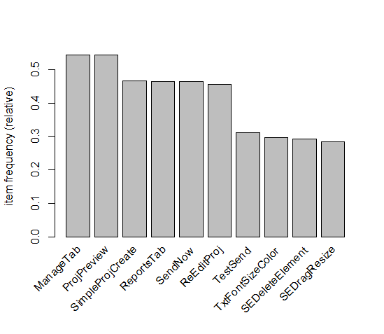
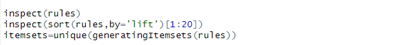
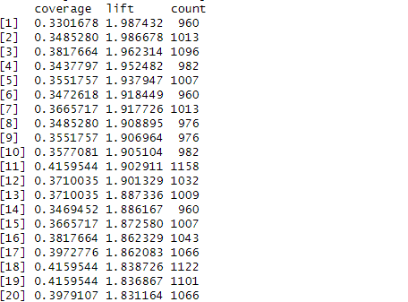
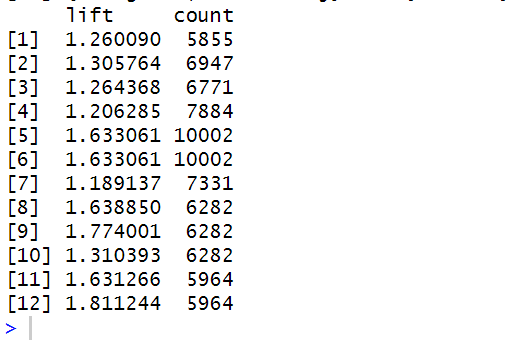

# Executive Summary
A comprehensive analysis of users and their sessions was performed using SimplyCast Data. SimplyCast is a company that provides automation solutions for businesses to provide better services and engage their customers through various mediums such as SMS/email marketing, social media content, and many more digital solutions. [\[1\]](https://www.simplycast.com/) The association mining process is used to analyze users' patterns and behavior while using this site which can further lead to businesses making informed decisions regarding their users. The Apriori algorithm in the association mining process identifies the association between users and their actions using metrics such as the score, confidence, lift, and count. These metrics for each association are created, displayed, and analyzed in the report.
# Objective
The main objective of this analysis is to identify the patterns a user follows when visiting a site such as SimplyCast and draw necessary insight from the association between different variables in the data. Being an automation solutions provider that has use cases for multiple industries, it is necessary to understand their users and their frequently used actions to understand them better and use them for business advancement and engage more customers. Using algorithms such as Apriori gives meaningful insights into the association of users, their interactions, and their sessions. Such insight can be further used to understand the relationship between website elements and user behaviors and identify user preference which in turn might lead to better marketing tactics.

About the Data

The data used is from the website Simplycast.com where the user and the sessions are extracted in the form of the user ID, the date of the session, and the action that occurred. 

**Users Table**

This table gives information on the user and their actions.

**Session Table**

This table gives information on the user and their action along with the date on which the action occurred.

# Methodology
## Preprocessing
1. **Data Loading:** The files required in the report are already given to us and because of that we don’t have to create tables in SQL. Both CSV files i.e. **users** and **session** were loaded into R such that the data is available for further processing.
1. **Data Transformation:** Milestone information for the **users** was already provided but for the association mining process, they needed to be combined into sequences that represent the journey of each user. The data was grouped with the help of the User ID and then were concatenated into sequences.
1. **Sequence Construction:** Sequences were constructed from the combined milestone data. Each sequence represents a set of milestones for a user. To do this, the milestones were arranged in sequential order to capture the events or actions performed by a user.
## Association Mining
1. **Item Frequency Plot**

   Before even starting the mining process, it was necessary to understand the data. A graph was plotted to identify the frequency of an event of a user. An item frequency plot was plotted to visualize the frequency of milestones occurring for each user.

1. **Apriori Algorithm**

   The Apriori algorithm is a popular way to do association mining in which the pattern of the milestones of each user is calculated. It identifies the occurrence of frequent milestones and generates the association rules based on the given support and confidence threshold.

   1. **Support Threshold**

      Here, a minimum value is set which determines which milestone can be considered frequent. The higher the threshold, the more significant the rules.

   1. **Confidence Threshold**

      It represents the reliability of an association rule. It tells how likely it is for milestone B to occur when the user performs action A. A Higher threshold yields rules with stronger predictive power.

Multiple sets of Apriori algorithms were performed with varying support and confidence thresholds, producing different sets of association rules and analyzing more significant association among the data.

# Association of Users
The actual process of association mining starts when the milestones’ CSV file is loaded into the R. As mentioned in the methodology before, the milestones are first converted into sequences separated by comma, and grouped by User ID. After that, an item's frequency plot is generated where it plots the milestones that frequently occurred in the dataset.
## Item Frequency Plot
It is needed to plot the frequency since it can tell a lot about the data itself. It can help in setting the threshold for the Apriori Algorithm, identifying the overall patterns of the data, and choose appropriate parameters for the threshold.

Here, we’ve only shown the top 10 occurrences of the milestones. It shows that the milestones “ManageTab” and “ProjPreview” were the most frequently used actions by the overall users in the dataset. 

## Association Rules
After getting some idea of the pattern of the data, the rules are generated. 

We tried multiple support and confidence thresholds. Setting the support threshold to 0.4 will generate a rule for only those milestones that occur at 40% in the dataset, similar to the 0.3 support threshold. In both cases, we set the confidence threshold to 0.5. 
## Rules Inspection
After satisfactory rules were generated that would give us plenty of results to analyze, the rule was then inspected. 

Inspecting the rules would display the association's rules along with their support and confidence values. It would allow us to visualize the associations that were discovered in the dataset. 

Sorting the result of inspection by ‘lift’ is necessary since lift gives us the strength of association between the antecedent and consequent of a rule considering the support of both milestones. The higher the lift value, the stronger the association between the milestones. A lift value greater than 1 suggests that the antecedent and consequent appear together more often than expected by chance.

Here, we are inspecting the top 20 such milestones. Since the milestones might get repeated in the data, only the unique items were extracted. 

The result of the inspection is as follows: 

In the above figure, ‘lhs’ is the antecedent, and ‘rhs’ is the consequent. Antecedents are set of items that are used to predict the probability of the consequent occurring.

As you can see in the figure, 30% of the milestones contain {ManageTab, ReEditProj, ReportsTab, SendNow}. And when the antecedent {ManageTab, ReEditProj, ReportsTab} is present, there is a 90% chance of {SendNow} occurring in the dataset.

We can also get the coverage, lift, and count of each milestone in the dataset from the inspection.
## Result
Inspecting the extracted unique milestones, we can clearly see the the items with the strongest support.

### Interpretation of Result
The analysis of frequent itemsets' output shows combinations of items alongside their associated support values. Support values signify the proportion of transactions wherein a specific itemset is present, illustrating its association within the dataset.

1. **{ManageTab}**

   The milestone ManageTab has support of 0.543 which means its occurrence in the dataset is about 54%. It is also the most common occurring event by the user in the dataset.

1. **{ProjPreview}**

   The milestone ProjPreviewhas support of 0.542 which means its occurrence in the dataset is about 54%. Along with ManageTab, ProjPreview is also the most frequently occurring milestone in the data. 

1. **{SendNow, SimpleProjCreate}**

   The presence of "SendNow" and "SimpleProjCreate" in around 32% of transactions shows a link between sending projects shortly after they are created. This pattern may indicate a trend in user behavior connected to project management or workflow operations.

1. **{ReEditProj, SimpleProjCreate}**

   The presence of "ReEditProj" and "SimpleProjCreate" in more than 31% of transactions implies that users frequently re-edit projects once they are created. This behavior pattern may provide insight into user engagement with project editing tools.
## Insights and Recommendation
The analysis of frequent itemsets gives useful information about user behavior and usage trends in the dataset. Understanding these patterns enables organizations to make informed decisions and adopt targeted initiatives to improve user experience and system functionality. 

For example:

- Using the popularity of "ManageTab" and "ProjPreview" to prioritize feature upgrades or user interface changes.
- Using the link between "SendNow" and "SimpleProjCreate" to simplify project management operations and increase user efficiency.
- Exploring ways to improve project editing functionalities based on the observed association between "ReEditProj" and "SimpleProjCreate."
# Association of Sessions
This process is of discovering interesting relationships among a set of items in session data which is provided in the “sessionDistinctMilestoneDec15.cs” file. This is achieved through a machine learning method known as association rule mining which identifies frequent patterns or correlations from datasets. In the context of session data, these “items” can be various actions or events logged during a user’s session. The goal is to find associations between different actions that tend to occur together within the same session. These associations can provide valuable insights into user behavior, which can help inform decision-making processes. For instance, if users who perform a certain action A often perform another action B in the same session, we might consider redesigning the user interface to make it easier to perform actions A and B together. The strength of these associations is typically measured using statistical metrics such as support and confidence. The support measures how frequently a rule applies to a given data set, while the confidence measures the reliability of the inference made by the rule.
## Item Frequency Plot
Below is the bar graph showing the frequency of the top 10 items as it will help us understand the generated rules later. It can also help in setting the threshold for the Apriori Algorithm, identifying the overall patterns of the data, and choosing appropriate support and confidence parameters for the threshold.

## Data Preparation
In the provided data, we grouped the data by user\_id and date and then created a list of actions that occurred during each session. This process effectively transposes the data from a long format, where each row represents a single action or event, to a wide format, where each row represents a single session and contains a list of all the actions or events that occurred during that session.

Once the data has been transposed, the user\_id column is removed, leaving only the list of actions or events for each session.

This transposed data is then converted into a transaction format which is used for association rule mining. 

## Association Rules
In our data of session, association rules can reveal how different actions or events during a user’s session are related. For instance, an association rule might suggest that if a user performs action A, they are likely to act B. These insights can be used to predict future user behavior, improve user experience, or identify areas for system improvement.

We tried multiple settings of support and confidence and found the following settings to be optimal.

## Rules Inspection
After satisfactory rules were generated just like we did for user data, we inspected the rules.

Inspecting the rules would display the association's rules along with their support and confidence values. It would allow us to visualize the associations that were discovered in the dataset. Since the milestones might get repeated in the data, only the unique items were extracted. 

Unique itemsets are also generated.

## Results Interpretation
In the above figures, ‘lhs’ is the antecedent, and ‘rhs’ is the consequent. Antecedents are set of items that are used to predict the probability of the consequent occurring. The support, confidence, coverage, lift, and count for each rule are also displayed.

For instance, the first rule {ReportsTab} => {ManageTab} with a support of 0.2369198 and confidence of 0.6952856 means that about 23.69% of all transactions contain both ReportsTab and ManageTab, and in about 69.53% of the transactions that contain ReportsTab, ManageTab also appears. The lift of 1.260090 indicates that ManageTab is 1.26 times as likely to be purchased when ReportsTab is purchased, compared to its general likelihood of being purchased.

Similarly, the rule {SendNow} => {ManageTab} with a support of 0.4047263 and confidence of 0.9010811 means that about 40.47% of all transactions contain both SendNow and ManageTab, and in about 90.11% of the transactions that contain SendNow, ManageTab also appears. The lift of 1.633061 indicates that ManageTab is 1.63 times as likely to be purchased when SendNow is purchased, compared to its general likelihood of being purchased.

The count column represents the absolute frequency of each rule in the dataset. For example, the rule {ReportsTab} => {ManageTab} occurs 5855 times in the dataset.
## Insights and Recommendations
The association rules generated from the session data provide valuable insights into user behavior. 

- High confidence of the rule {SendNow} => {ManageTab} suggests that users who perform the SendNow action are very likely to also perform the ManageTab action. 
- The process of navigating from the SendNow action to the ManageTab action can be streamlined, reducing the number of steps or clicks required. 

Similarly, actions that frequently occur together could be grouped or highlighted in the user interface to make them more accessible. 

# Appendix
## User Code

## Session Code

# References
1\. SimplyCast. (n.d.). SimplyCast - Marketing Automation Software. Retrieved March 19, 2024, from<https://www.simplycast.com/>

